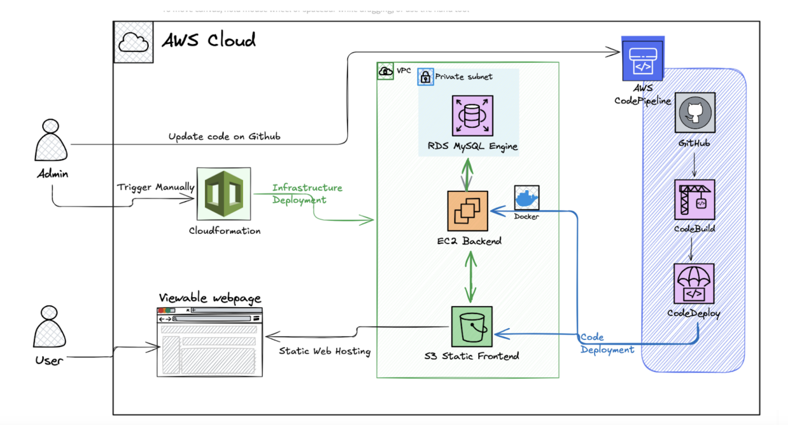

# Automating Web Application Deployment using  AWS Native Tools

## Project Overview

This project focuses on automating the deployment and management of a web application's infrastructure and codebase. The goal is to enhance delivery speed, reliability, and consistency across environments. The application comprises two main components:

1. **Frontend**: A static web interface.  
2. **Backend**: A server-side API.  

The project uses AWS services to manage the infrastructure, which includes components such as EC2, S3, RDS PostgreSQL, and VPC (with subnets, IGWs, route tables, NAT, and NACLs).

---

## Objectives

1. **Automate Infrastructure Deployment**  
   - Use Infrastructure as Code (IaC) to provision and manage cloud resources.  

2. **Automate Application Deployment**  
   - Implement continuous integration and continuous delivery (CI/CD) pipelines to automatically build, test, and deploy frontend and backend components whenever changes are made.  

3. **Ensure Environment Consistency**  
   - Standardize configuration templates and deployment processes across all environments.  

---

## AWS Components and Services

### 1. **AWS CodePipeline**  
   - **Purpose**: Automates CI/CD pipelines for infrastructure and application code.  
   - **Usage**: Pulls code from repositories, triggers builds, runs tests, and deploys to various environments.  

### 2. **AWS GitHub Connect**  
   - **Purpose**: Acts as the source control service for managing repositories.  
   - **Usage**: Hosts Git-based repositories for both CloudFormation templates and application code (frontend/backend).  

### 3. **AWS CodeBuild**  
   - **Purpose**: Compiles source code, runs tests, and produces deployment artifacts.  
   - **Usage**: Builds application artifacts, runs unit tests, and prepares deployment packages.  

### 4. **AWS CloudFormation**  
   - **Purpose**: Provides an IaC service to create and manage AWS resources using declarative templates.  
   - **Usage**: Deploys and manages the infrastructure required for both frontend and backend components based on CloudFormation templates.

## File Descriptions

1. **`appspec.yml`**: Specifies deployment instructions for AWS CodeDeploy. It maps the backend files to their destination on the server and includes lifecycle hooks:
   - **BeforeInstall**: Cleans up previous deployments using `cleanup.sh`.
   - **AfterInstall**: Installs dependencies using `install_dependencies.sh`.
   - **ApplicationStart**: Starts the server using `start_server.sh`.
2. **`buildspec.yml`**: Defines the build process for AWS CodeBuild. It automates:
   - Installing Node.js dependencies for the backend.
   - Zipping the frontend static files for deployment.
   - Packaging the backend files for CodeDeploy.
   - Preparing the artifacts (e.g., `backend.zip` and `frontend.zip`) for deployment.
3. **`frontend/`**: This folder contains the source code for the frontend static web application. The build process compiles this code into optimized assets for deployment to an S3 bucket or other hosting service.
4. **`backend/`**: This folder contains the source code for the backend server-side API. The build process packages this code for deployment to an EC2 instance or other compute services.
5. **`scripts/`**: This folder contains helper scripts used during the deployment process. Examples include scripts for installing dependencies, restarting services, or running database migrations.
6. **`aws-project-arch.png`**: This is an image file illustrating the architecture of the project, showing the relationships between AWS services and application components.
7. **`README.md`**: This documentation file provides an overview of the project, explains its objectives, and describes the purpose of each file.

---

## What the Code Does

- **Frontend Deployment**: The frontend code in the `frontend/` directory is built and deployed as static files to an S3 bucket, providing a scalable and cost-effective way to serve the user interface.
- **Backend Deployment**: The backend code in the `backend/` directory is packaged and deployed to EC2 instances, enabling dynamic server-side logic and API functionality.
- **Infrastructure Automation**: Using the `appspec.yml` and `buildspec.yml` files, the pipeline automates the entire process of provisioning infrastructure, building applications, and deploying them.
- **CI/CD Integration**: AWS CodePipeline orchestrates the CI/CD process, ensuring that any changes to the codebase trigger automated builds and deployments, reducing manual effort and risk of errors.
- **Scalability and Consistency**: AWS CloudFormation ensures that infrastructure is provisioned consistently across environments using predefined templates, avoiding configuration drift.

Feel free to reach out with any questions or suggestions!
